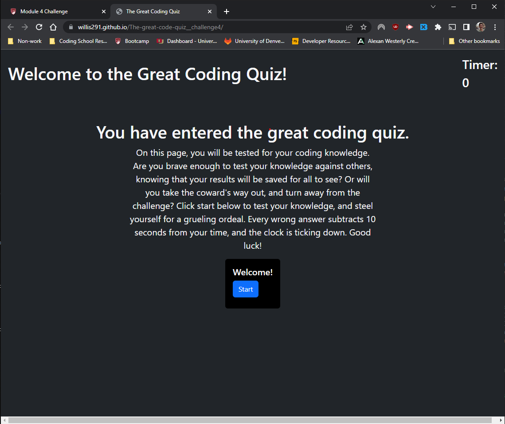
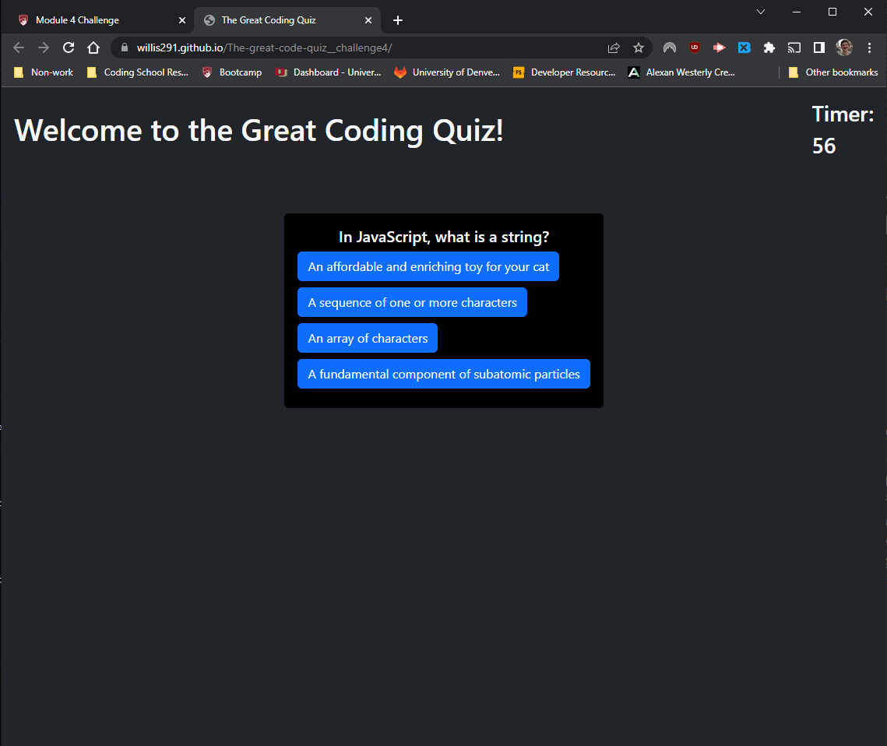
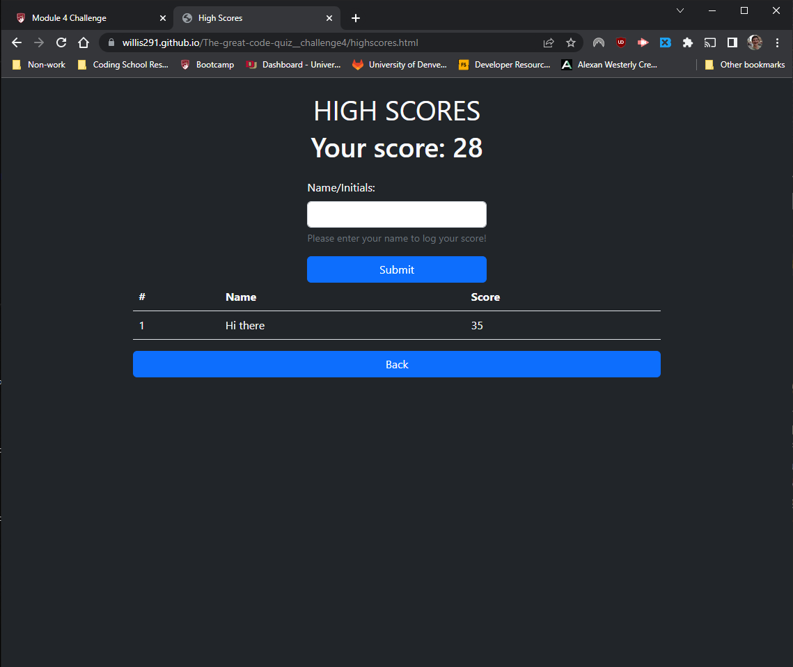

# The-great-code-quiz\_\_challenge4

This is a webpage that gives the user a quiz on various coding concepts. It's a simple app that I made during my coding bootcamp

## Deployed page

### Found here: https://willis291.github.io/The-great-code-quiz__challenge4/

## General Notes

This coding challenge took a little longer than expected, but felt rather rewarding. The look of it is much sleeker than I was able to manage for previous challenges, thanks in large part to the new knowledge of bootstrap, rather than having to slog through CSS.

### Things to note

- It is important to note that the decision to stay on the same question when the user answers wrong was intentional. I figured this would make the quiz a little harder, though in all honesty a designer could make the choice to advance the questions on an incorrect answer as well.
- This code uses local storage in order to save high scores. The scores should theoretically be saved when returning to the high score page.

## Screenshots

### The main starting page:

### Question page:

### Score page:

